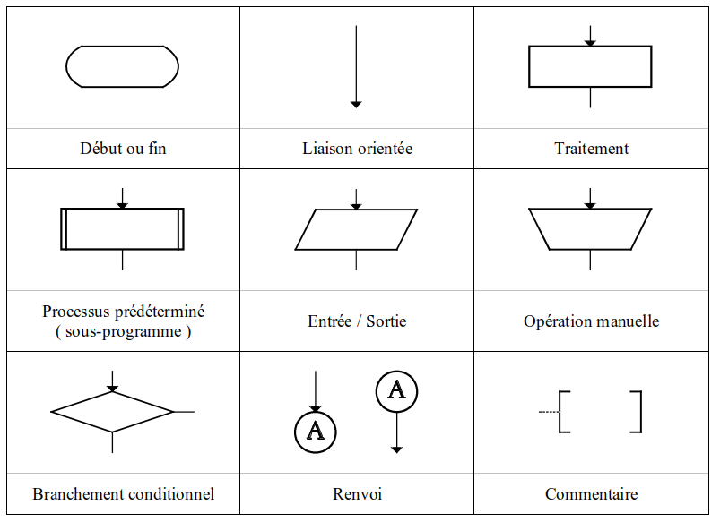

## Cycle de développement logiciel

Le cycle de développement d'un logiciel se décompose en plusieurs étapes que nous pouvons retrouver à travers ce schéma :


[Goffinet, F. (2021, 11 novembre). Concepts de développement logiciel.](https://cisco.goffinet.org/devasc/concepts-dev-developpement-logiciel/)

Le schéma représente un cercle fermé car un logiciel ne "meurt" jamais. Il est en constante évolution dû à des besoins utilisateurs grandissants.

## Algorithme

**Qu'est-ce qu'un algorithme ?**

- Un **algorithme** est une **suite d'actions** qui suivent un **ordre précis**.
- Cette suite d'actions est représente les **traitements** sur les données.
- Un algorithme **ne s'exécute pas**, il représente les étapes que le programme devra faire.
- Un algorithme doit être **clair** et **précis**.
- Avant de coder la solution, un algorithme doit être traduit en **ordinogramme**.

**Exemples d'algorithmes que vous connaissez déjà :**

- Une recette de cuisine.
- Les instructions pour assembler un meuble.
- Les instructions pour préparer un café chaud avec du lait.
- La méthode pour calculer la somme des nombres de 1 à 100.
- Etc.

## Ordinogramme

- Un **ordinogramme**, aussi appelé organigramme de programmation est une
représentation graphique de l'enchaînement des opérations, des décisions ou des
fonctions à réaliser par un programme.
- Le programmeur devra traduire l'ordinogramme à l'aide d'un **langage de
programmation**.
- **L'organigramme** de programmation utilise des **symboles normalisés** représentés ci-
dessous :



## Qu'est-ce qu'un programme ?

- Un **programme** est une **suite d'instructions** écrites dans un **langage de programmation** qu'un système informatique comprend et exécute.
- Un **programme** résulte des instructions (étapes) définies dans ***l'ordinogramme***.

## Qu'est-ce qu'un langage de programmation ?

- Un **langage de programmation** est un **ensemble de mots clés** et des **règles de syntaxe** qui permettent d'écrire un ***programme*** exécutable par un système
informatique.
- **Ex**: Python, Java, C#, Matlab, ....
- Langages de programmation les plus populaires : [TIOBE Index - TIOBE](https://www.tiobe.com/tiobe-index/)

Et le gagnant est....

## Pourquoi le python ?

Python est un langage interprété orienté objet. C'est un langage très facile à prendre en main. Sa syntaxe simple offre une multitude de possibilité de développement. Il est possible de créer **ses propres modules** qui seront ensuite partagées à la communauté.
Exemple : [pipy](https://pypi.org/).

C’est un “vrai” langage :
- types de données,
- branchements conditionnels,
- boucles,
- procédures et fonctions,
- objets et classes,
- découpages en modules.

Python propose les outils standards suivants :
- **Données typées** : entiers, réels, booléens, chaîne de caractères.
- **Structures avancées de données** : listes, dictionnaires, classes.
- **Séquences d’instructions** : écrire et exécuter une série de commandes sans avoir à intervenir entre les instructions.
- **Structures algorithmiques** : branchements conditionnels et boucles.
- **Programmation structurée** : utiliser les procédures et fonctions pour mieux organiser son code.
- Appeler plusieurs fichiers d’extension “.py” dans d’autres programmes à l’aide de la commande “import”.

Exemple de programme simple dans python :

```python
# Exemple d'un programme simple qui effectue la somme de 2 nombres
# Données en entrée
x = 5
y = 7

# Traitement
somme = x + y

# Affichage
print(f'La somme {x} + {y} est égale à {somme}')
```

[Exemple à télécharger](exemple_programme.py)

Voyons ensemble comment exécuter ce programme.

## Qu'est-ce que l’analyse du problème ?

**L'analyse du problème**

- L'analyse du problème est une étape cruciale dans le processus de résolution de problèmes en informatique.
- Elle implique la détermination des **données d'entrée**, **des données de sortie** et de la nature des **traitements**.

**Les données d'entrée**

- Les **données d'entrée** sont les informations dont nous disposons au début. En bref, la question qui se pose est de quoi avons nous besoin pour obtenir le résultat recherché?
- Les données en entrée peuvent provenir de diverses sources, comme des observations, des mesures, des expériences ou même des hypothèses. Par exemple, si nous étudions la croissance des plantes, les données d'entrée pourraient être la **quantité de lumière, la température, le type de sol, etc.** 

**Les données de sortie**

- Les données **de sortie** sont les **résultats** que nous souhaitons obtenir à partir des données d'entrée.
Dans l'exemple de croissance des plantes, les données de sortie pourraient être la **hauteur de la plante, le nombre de feuilles, la couleur des fleurs, etc.**

**Les traitements**

- Les **traitements** sont les **modifications, manipulations faites sur les données d'entrée** pour obtenir les données de sortie.
- Cela peut impliquer des calculs mathématiques, des expériences en laboratoire, des simulations informatiques, etc.
- Dans l'exemple de la croissance des plantes, le traitement pourrait consister à **planter des graines dans différents types de sol et à mesurer leur croissance au fil du temps.**

En résumé, l'analyse du problème est une étape essentielle qui nous permet de comprendre clairement ce que nous savons, ce que nous voulons savoir et comment nous allons utiliser les informations disponibles pour obtenir les résultats souhaités. C'est une compétence précieuse pour tout scientifique en herbe.


## Atelier

Télécharger le fichier ci-dessous et compléter les exercices : [Analyse du problème](Analyse_de_probleme.docx)

**RAPPEL** : Vous devez terminer ces 5 exercices avant la fin de la séance.