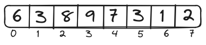

# Pourquoi utiliser des listes ?


## Mise en situation

Vous devez gérer les données des étudiants du cours.
Chaque étudiant a un nom et un âge.
Vous ne savez pas combien d'étudiants seront inscrits dans le cours.
Vous devez afficher le nom de tous les étudiants et leur âge.


### Solution sans liste

```python
# On saisit chaque variable
etudiant_01_nom = "Emma"
etudiant_01_age = 18
etudiant_02_nom = "Julien"
# ....
etudiant_37_age = "20"


# On affiche les noms et âge un par un
print(etudiant_01_nom, etudiant_01_age)
# ....
print(etudiant_37_nom, etudiant_37_age)
```


### Solution avec une liste

L'utilisation des listes permettra d'exécuter cette tâche beaucoup plus facilement.
Vous pourrez ajouter/modifier/enlever des étudiants.
Et vous pourrez ajouter plusieurs informations pour chaque étudiant.  

```python
# On remplit la liste
etudiants = []
etudiants.append(["Emma", 18])
etudiants.append(["Julien", 17])
....
etudiants.append(["Sophie", 20])

# On affiche les noms et âge dans une boucle
for e in etudiants:
    print(e[0], e[1])
```


# Qu'est-ce qu'une liste ?

En Python, une liste est une collection ordonnée et modifiable d'éléments. Les listes sont utilisées pour stocker plusieurs éléments dans une seule variable et peuvent contenir des éléments de différents types, y compris des nombres, des chaînes de caractères, d'autres listes, etc. Les listes en Python sont définies en utilisant des crochets [].

## Caractéristiques d'une liste

- **Ordonnée** : Les éléments de la liste conservent un ordre défini, ce qui signifie que l'ordre dans lequel vous ajoutez les éléments est préservé.
- **Modifiable** : Une liste peut être modifiée après sa création, ce qui signifie que vous pouvez ajouter, supprimer ou changer des éléments.
- **Taille Dynamique** : Une liste en Python peut changer de taille dynamiquement. Vous pouvez ajouter ou supprimer des éléments sans avoir à spécifier la taille initiale de la liste.
- **Hétérogène** : En *Python*, une liste peut contenir des éléments de différents types (entiers, chaînes de caractères, listes, etc.).
    - Bien qu'il est possible de le faire, il faut rester prudent lorsqu'on utilise des listes hétérogènes. Elles pourraient entraîner des erreurs, notamment dans les boucles.


# Comment utiliser une liste ?

## Fonctions et méthodes

| Fonctions |  |
| ---- | ----|
| len() | Retourne la longueur de la liste |
| max() | Retourne la valeur maximum de la liste |
| min() | Retourne la valeur minimum de la liste |


| Méthodes |  |
| ---- | ----|
| append() | Ajoute un élément à la fin de la liste |
| insert() | Ajoute un élément à un endroit spécifique dans la liste |
| remove() | Supprime un élément de la valeur spécifiée |
| pop() | Supprime un élément selon sa position et retourne la valeur |
| del() | Supprime un élément selon sa position |
| [] | Permet d'accéder à un élément de la liste selon sa position |
| extend() | Ajoute tous les éléments d'une liste dans une autre liste |
| clear() | Efface tous les éléments d'une liste |
| index() | Retourne l'indice du premier élément dont la valeur est égale à celle spécifiée |
| sort() | Trie les éléments de la liste |
| reverse() | Inverse l'ordre des éléments de la liste |
| copy() | Retourne une copie superficielle de la liste |


## Opérations simples

### Création d'une liste

```python
# Création d'une liste vide
maListe = []
# ou
maListe = list()

# Liste avec des éléments
maListe = [6, 3, 8, 9, 7, 3, 1, 2]
```





### Accès aux Éléments d'une Liste

Les crochets `[]` sont utilisés pour accéder directement à l'élément correspondant.  

```python

# Accès au premier élément
print(maListe[0])  # Affiche 6

# Accès au dernier élément
print(maListe[-1])  # Affiche 2

# Opérations sur les éléments de la liste
x = maListe[1] + maListe[3]  # est l'équivalent de 3 + 9, soit les éléments qui se trouve aux indices 1 et 3
print(x)    # Affiche 12
```


Notez que les indices commencent à zéro.

### Ajout d'Éléments

```python
# Liste vide
maListe = []
```


```python
# Ajoute la valeur 6 à la fin de la liste
maListe.append(6)
```


```python
# Ajoute la valeur 3 à la fin de la liste
maListe.append(3)
```


```python
maListe.append(8)
maListe.append(9)
maListe.append(7)
maListe.append(3)
maListe.append(1)
maListe.append(2)
```


### Modification des Éléments


```python
# La valeur de la case à l'indice 2 est maintenant 0
maListe[2] = 0

# La valeur de la case à l'indice 4 est maintenant la même que celle de la case à l'indice 7
maListe[4] = maListe[7]
```


```python
# isch...
maListe[0] = maListe[maListe[7]]

# Décomposition du problème
indice = maListe[7]   # indice vaut 2
nouvelleValeur = maListe[indice]   # nouvelleValeur vaut maListe[2], soit 0
maListe[0] = nouvelleValeur    # La case à l'indice 0 vaut maintenant 0
```


```python
# Même logique...
maListe[4] = maListe[maListe[7] + maListe[6]]

# Décomposition du problème
indice = maListe[7] + maListe[6]   # indice vaut 3
nouvelleValeur = maListe[indice]   # nouvelleValeur vaut maListe[3], soit 9
maListe[4] = nouvelleValeur    # La case à l'indice 4 vaut maintenant 9
```


### Suppression d'Éléments


```python
# Supprime le dernier élément de la liste
maListe.pop()
```


```python
# Supprime l'élément à l'indice 2
maListe.pop(2)
```


```python
# Supprime la première occurrence de la valeur 3
maListe.remove(3)
```


### Insertion

```python
# Insert la valeur 7 à la case 3
maListe.insert(3, 7)
```


### Triage

```python
# La liste est triée en ordre croissant
maListe.sort()
```


```python
# La liste est triée en ordre décroissant
maListe.sort(reverse=True)
```


## Dans une boucle


Il est possible de parcourir chacun des éléments de la liste avec une boucle FOR:

```python
# Affichage de chacun des éléments de la liste
for element in maListe:
    print(element)
```

Il est aussi possible d'utiliser la fonction `range()` afin de parcourir la liste à l'aide des indices:

```python
# On additionne 1 à chaque élément de la liste
for i in range(len(maListe)):
    maListe[i] = maListe[i] + 1
```


Il est aussi possible de parcourir une liste dans une boucle WHILE:

```python
# On affiche les premiers éléments de la liste.
# On arrête dès que le total atteint au moins 10

maListe = [1, 2, 3, 4, 5, 6, 7]
total = 0
i = 0
while total < 10:
    print(maListe[i])
    i += 1
```


## Les listes dans les listes

Il est possible de mettre n'importe quel type d'élément dans les listes.
Il est donc possible de mettre des listes dans des listes.
Nous parlons alors de listes (ou tableaux) en 2 dimensions.


```python
# Liste contenant 3 éléments
# Chaque élément est une liste contenant 2 nombres
matrice = [[1, 2], [3, 4], [5, 6]]
```

Pour parcourir toutes les listes, il suffit de mettre une boucle dans une boucle :

```python
# On parcourt chaque éléments de la liste principale
for sousliste in matrice:
    # et ensuite chaque élément de la "sous-liste"
    for e in sousListe:
        print(e)
```


Les opérations vues sur les listes en 1 dimension fonctionnent aussi pour les listes en 2D:

```python
print(matrice[0]) # affiche la première liste de la matrice
print(matrice[0][1]) # affiche le 2e élément de la première liste de la matrice

matrice.append([7, 8]) # ajoute une nouvelle liste à la matrice
```

Il est aussi possible de parcourir les listes en utilisant les indices et la fonction `range()`:

```python
# On ajoute 1 à chaque élément de la matrice
for i in range(len(matrice)):
    for j in range(len(matrice[i])):
        matrice[i][j] += 1
```


# Ateliers

[Atelier sur les listes](atelier_listes.ipynb)
