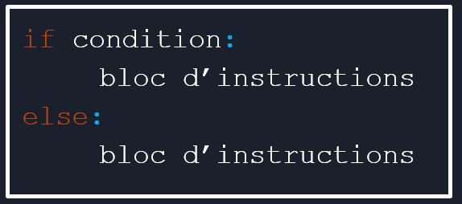
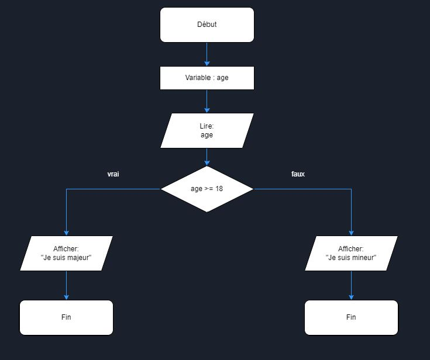
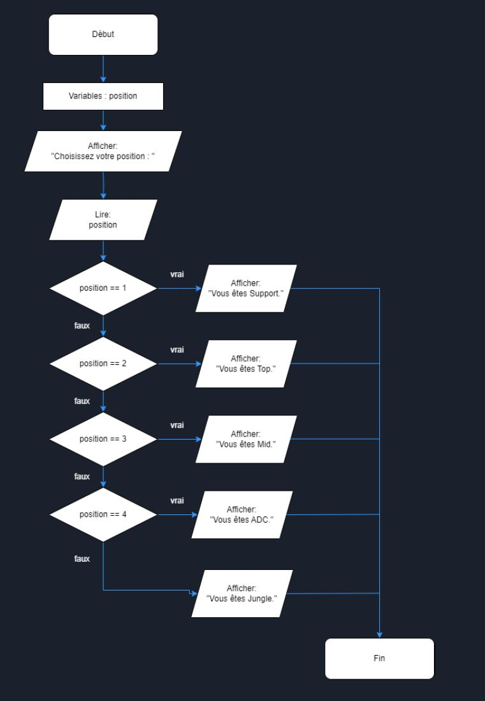

## Structures conditionnelles - **if**

Au cours de son déroulement, un programme a besoin de prendre des décisions en fonction des données qu'il rencontre.

Comment cela se traduit ?



- La condition est très souvent une **opération de comparaison**.
- Attention au **:** qui est primordial.
- C'est l'**indentation** (le décalage par rapport à la marge gauche) qui délimite le bloc d'instructions.
- La partie **else** est facultative.

## Exemple simple

```python
# Nous demandons à l'utilisateur de saisir un âge
age = int(input("Saisir votre âge :"))

# Nous testons l'âge à partir de la valeur saisie par l'utilisateur
# Nous pouvons noter dans cet exemple la "condition" qui permet de définir, grâce à l'âge, si la personne est majeure ou mineure.
if age >= 18:
    print("Vous êtes majeur(e).")
else:
    print("Vous êtes mineur(e).")

```

L'ordinogramme suivant représente le code écrit ci-dessus :



## Structures conditionnelles - Succession de if avec **elif**

Il est naturel de se retrouver à devoir prendre un décision en fonction de multiples choix. Comment cela fonctionne avec Python ?

```python
# Cet algorithme a pour but de permettre à un utilisateur de choisir sa position dans "League of Legends"
print("1. Support")
print("2. Top")
print("3. Mid")
print("4. ADC")
print("5. Jungle")

# L'utilisateur saisir un code en fonction de sa position
position = int(input("Choisissez votre position : "))

# Le code saisi dans la variable position est testé pour afficher la position du joueur
if(position == 1):
    print("Vous êtes Support")
elif(position == 2):
    print("Vous êtes Top")
elif(position == 3):
    print("Vous êtes Mid")
elif(position == 4):
    print("Vous êtes ADC")
else:
    print("Vous êtes Jungle")

print("Bienvenue dans la faille de l'invocateur !")
print("Des sbires sont apparus.")

```

- **elif** n'est déclenché que si la (les) condition(s) précédente(s) a (ont) échoué.
- **elif** est situé au même niveau que *if* et *else*.
- On peut en mettre autant que l'on veut.

L'ordinogramme suivant représente le code écrit ci-dessus :



## Atelier

[Atelier sur les structures conditionnelles](Structures_conditionnelles_exercices.pdf)

## Exemples

[Exemples en .ipynb](Python_Structures_conditionnelles.ipynb)